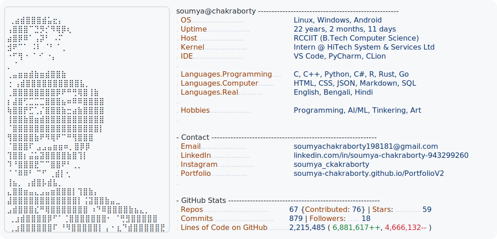

  <a href="https://github.com/Soumya-Chakraborty/Soumya-Chakraborty">
    <picture>
      <source media="(prefers-color-scheme: dark)" srcset="dark_mode.svg">
      
    </picture>
  </a>

 

# 🌟 **Soumya Chakraborty** 🌟

---

### 👨‍💻 **About Me**

Greetings! I'm a passionate programmer weaving digital magic at the intersection of technology and creativity. My journey is fueled by an insatiable curiosity and a love for transforming ideas into innovative solutions.

- 🎓 **Education:** B.Tech in Computer Science, RCC Institute of Information Technology
- 💼 **Professional:** Intern at HiTech System & Services Ltd.
- 🎨 **Philosophy:** *"I don't just write code, I craft digital experiences. When I'm not debugging, I'm creating art that tells a story."*

---

### 🛠️ **Technology Palette**

  

#### **Languages & Frameworks I Speak**
- **Core Languages:** `C`, `C++`, `Python`, `C#`, `R`, `Rust`, `Go`
- **Web & Markup:** `HTML5`, `CSS3`, `Markdown`, `JSON`
- **Databases:** `SQL` / `MySQL`

---

### 📊 **My GitHub Odyssey**

<picture>
  <source 
    srcset="https://github-readme-stats.vercel.app/api?username=Soumya-Chakraborty&show_icons=true&theme=dracula&hide_border=true&rank_icon=github"
    media="(prefers-color-scheme: dark)"
  />
  <source
    srcset="https://github-readme-stats.vercel.app/api?username=Soumya-Chakraborty&show_icons=true&theme=default&hide_border=true&rank_icon=github"
    media="(prefers-color-scheme: light), (prefers-color-scheme: no-preference)"
  />
  
</picture>
<picture>
  <source 
    srcset="https://github-readme-streak-stats.herokuapp.com/?user=Soumya-Chakraborty&theme=dracula&hide_border=true"
    media="(prefers-color-scheme: dark)"
  />
  <source
    srcset="https://github-readme-streak-stats.herokuapp.com/?user=Soumya-Chakraborty&theme=default&hide_border=true"
    media="(prefers-color-scheme: light), (prefers-color-scheme: no-preference)"
  />
  
</picture>

---

### 🌟 **Spotlight Projects**

---

### 🌐 **Let's Connect & Collaborate!**

---

### 🔗 **Quick Navigation**

📂 **[All Repositories](https://github.com/Soumya-Chakraborty?tab=repositories)** │ 🌐 **[Personal Portfolio](https://soumya-chakraborty.github.io/PortfolioV2/)**

 

 

 

 

**✨ Always Learning, Forever Creating ✨**

